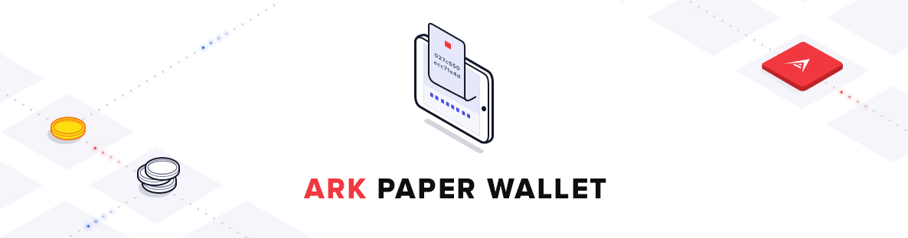

# Ark Paper Wallet

    

> Paper wallet generator for the Ark cryptocurrency.

## Getting Started

Open `index.html` in your favorite browser.

## Development

1. Install a recent version of NodeJs >=11.12.0
2. Install required commands `npm install -g bower concurrently gulp`
3. Install package dependencies `npm install`
4. Install bower dependencies `bower install`
5. Build the app and watch for modifications `npm run watch`
6. Open `index.html` in your favorite browser

## Security

If you discover a security vulnerability within this project, please send an e-mail to security@ark.io. All security vulnerabilities will be promptly addressed.

## Contributing

Please see [Contributing Guidelines](https://docs.ark.io/guidebook/contribution-guidelines/contributing.html) for details.

## Credits

This project exists thanks to all the people who [contribute](../../contributors).

## License

[MIT](LICENSE) © [ArkEcosystem](https://ark.io)
